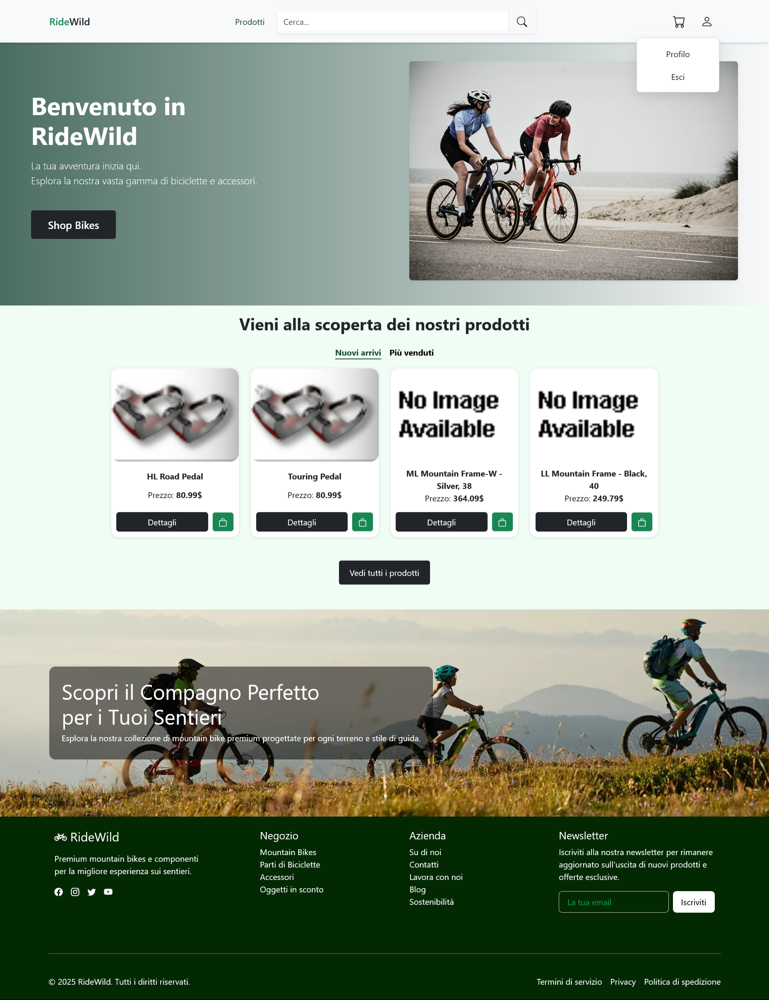
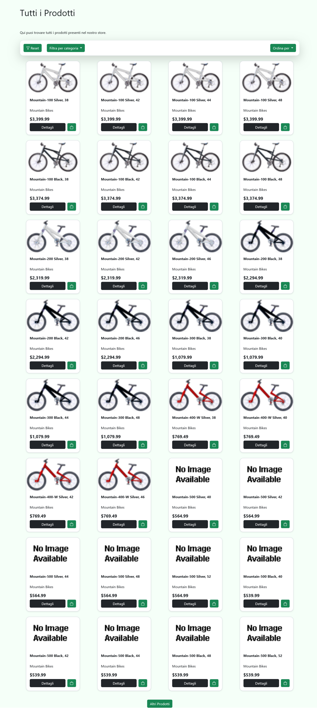
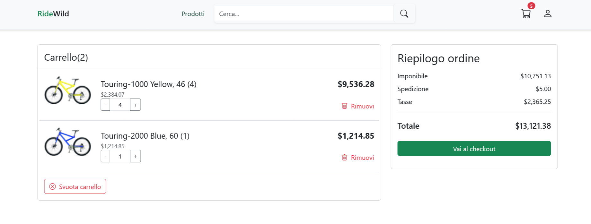
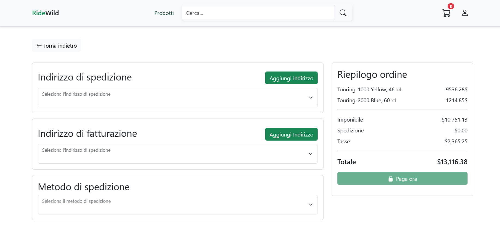

A Single Page Application developed with:

Backend: ASP.NET Core 9 + Entity Framework + MVC

Frontend: Angular 19

Database: SQL Server (AdventureWorksLT2019 sample database from Microsoft) + MongoDB (for auxiliary data)

The application simulates an eCommerce platform for the sale of mountain bikes and related components.

## Features
### User
- Multiple user roles and access levels
- Product search, filtering, and browsing
- Add products to cart (Local Storage for unauthenticated users)
- Checkout and order creation
- Payments (Stripe)
- AI chatbot
- Real-time chat between user and Admin (SignalR)
### Admin
- Product management, orders, and stock control
### Authentication & Security
- Register / Login / Logout (JWT)
- Automatic email notifications for password change confirmation
- Legacy user management (historical users support)

##

### Home Page

### Products Page

### Cart

### Checkout

### 🎬 Demo

##
